# 👂 Core: Adaptive ASR

A1 uses a multi-stage audio pipeline known as **Adaptive Ear**.

## 🎛️ The Pipeline

```mermaid
flowchart LR
    Mic[🎙️ Stream] --> VAD{Energy > Threshold?}
    
    subgraph "Fast Path (CPU)"
        VAD -- No --> Drop[🗑️ Drop]
        VAD -- Yes --> Wake[🔔 Vosk Check]
    end
    
    subgraph "Deep Path (GPU)"
        Wake -- "Hey A1" --> Rec[🔴 Record 5s]
        Rec --> Whisper[📝 Whisper Small]
        Rec --> ID[🆔 SpeechBrain ID]
    end
    
    Whisper --> Merge(🧩 Synthesis)
    ID --> Merge
    Merge --> Output[Generic Text]
```

## 🗣️ Multilingual Support (Context Priming)

We "hack" Whisper by injecting a system prompt containing Tanglish keywords before every transcription.

| Language | User Says | Whisper Hears |
| :--- | :--- | :--- |
| **English** | "Open the terminal." | `Open the terminal.` |
| **Tanglish** | "Terminal open pannu." | `Terminal open pannu.` |
| **Tamil** | "Mani enna?" | `Mani enna?` |

## 🆔 Speaker Verification
Uses **ECAPA-TDNN** to compare voice embeddings.
- **Verified**: `Cosine Sim > 0.75`
- **Unverified**: `Cosine Sim < 0.75` (Restricted access)

---
## 🕸️ Connections
- Feeds text into [[Core/Core_Router|Router]].
- Uses [[Configuration/Voice_Enrollment|Voice Enrollment]] profile.
- See [[Design/Threat_Model#1. Voice Command Injection|Security Risks]].

[[00_Index|🔙 Return to Index]]
