# 🔊 Core: Text-To-Speech

A1 now features a **dual-engine TTS system** with XTTS v2 voice cloning for premium English synthesis and Piper as a reliable fallback.

## 🎯 TTS Engine Selection

| Language | Engine | Notes |
| :--- | :--- | :--- |
| **English** | `XTTS v2` | Voice cloning from reference audio |
| **Tamil** | `Piper` | Telugu model (proxy) |
| **Fallback** | `Piper` | Used when XTTS unavailable |

---

## 🌟 XTTS v2 (Voice Cloning)

> [!SUCCESS] NEW in v1.3
> A1 can now speak in **your voice** using Coqui's XTTS v2 model.

### Configuration

| Parameter | Value |
| :--- | :--- |
| **Model** | `tts_models/multilingual/multi-dataset/xtts_v2` |
| **Reference Audio** | `models/speaker.wav` |
| **Language** | English (`en`) |
| **Device** | CUDA (GPU) preferred, CPU fallback |

### Setup Requirements
1. **Python 3.11** (via pyenv)
2. **Reference Audio**: Place a 5-15 second WAV file at `models/speaker.wav`
3. **First Run**: Model downloads automatically (~1.5GB)

### Voice Cloning Flow

```mermaid
graph LR
    Text[📝 Text] --> XTTS[🎙️ XTTS v2]
    Speaker[🔊 speaker.wav] --> XTTS
    XTTS --> Clone[🗣️ Cloned Voice]
    Clone --> SD[🔈 sounddevice]
```



---

## 🔧 Piper TTS (Fallback)

The original **Piper Neural TTS** engine remains as a fast, offline fallback.

| Parameter | Value | Reason |
| :--- | :--- | :--- |
| **Engine** | `piper` (Binary) | CPU-friendly, instant startup |
| **Model (EN)** | `voice.onnx` | English with Indian accent |
| **Model (TA)** | `voice_te.onnx` | Telugu (Tamil proxy) |
| **Output** | `aplay` | Raw PCM to ALSA |

### Piper Flow

```mermaid
graph LR
    Brain[🧠 Llama 3.1] -->|Text| Cleaner[🧹 Text Cleaner]
    Cleaner -->|echo| Piper[🗣️ Piper]
    Piper -->|PCM| Aplay[🔈 Speaker]
```



---

## 🗣️ Language Detection

A1 automatically detects the language and routes to the appropriate engine:

```python
# Tamil Unicode Range: 0B80–0BFF
if re.search(r'[\u0b80-\u0bff]', text):
    return "ta"  # Use Piper
return "en"  # Use XTTS (or Piper fallback)
```

> [!WARNING] Tamil Script Limitation
> While A1 **understands** Tamil/Tanglish input, TTS output in native Tamil script is experimental.
> - ✅ "Vanakkam" (Romanized) → Speaks correctly
> - ⚠️ "வணக்கம்" (Script) → Uses Telugu model

---

## 🎤 Interruption Handling

Both engines support real-time voice interruption:

| Trigger Word | Action |
| :--- | :--- |
| `stop` | Immediately halt speech |
| `cancel` | Halt and discard |
| `wait` | Pause playback |
| `hey` | Wake word detected |

---

## 📊 Performance Comparison

| Metric | XTTS v2 | Piper |
| :--- | :--- | :--- |
| **Quality** | ⭐⭐⭐⭐⭐ | ⭐⭐⭐⭐ |
| **Latency** | ~2-3s (GPU) | ~200ms |
| **VRAM** | ~4GB | 0 (CPU) |
| **Voice Clone** | ✅ | ❌ |
| **Offline** | ✅ | ✅ |

---

## 🕸️ Connections
- Receives text from [[Core/Core_Brain_LLM|Brain]]
- Receives commands from [[Core/Core_Router|Router]]
- See [[XTTS_Setup|XTTS Setup Guide]] for voice cloning setup
- See [[Design/Design_Decisions#2. Why Piper TTS?|Design Rationale]]

[[00_Index|🔙 Return to Index]]
