# 🎙️ XTTS v2 Voice Cloning Setup

> [!SUCCESS] Feature Added in v1.3
> A1 can now speak in **your voice** using Coqui's XTTS v2 model.

## Overview

A1 now supports **XTTS v2** for high-quality, cloned voice synthesis. This allows the assistant to speak in a custom voice that matches a reference audio sample.

## Requirements

| Requirement | Value | Notes |
| :--- | :--- | :--- |
| **Python** | 3.9 - 3.11 | Current: 3.11.11 via pyenv |
| **Package** | `TTS>=0.22.0` | Auto-installed |
| **GPU** | Recommended | CUDA for faster inference |
| **VRAM** | ~4GB | Or ~8GB RAM for CPU |

---

## 📝 Setup Instructions

### 1. Create a Speaker Reference File

Place a WAV file at:
```
A1/models/speaker.wav
```

**Requirements for the reference audio:**

| Property | Requirement |
| :--- | :--- |
| **Duration** | 5-15 seconds of clear speech |
| **Format** | WAV (16-bit, mono or stereo) |
| **Quality** | Clean recording, minimal background noise |
| **Content** | Natural speaking voice (not singing) |

### 2. Recording Tips

> [!TIP] Best Practices
> - Use a quiet environment
> - Speak naturally at a consistent volume
> - Avoid long pauses
> - A short paragraph reading works well

### 3. Quick Test

```bash
cd A1
./venv/bin/python -c "from core.speak import speak; speak('Hello, this is a test.')"
```

---

## ⚙️ Behavior

```mermaid
graph TD
    Input[📝 Text Input] --> LangDetect{Language?}
    LangDetect -->|English| SpeakerCheck{speaker.wav exists?}
    LangDetect -->|Tamil| Piper[🗣️ Piper TTS]
    SpeakerCheck -->|Yes| XTTS[🎙️ XTTS v2]
    SpeakerCheck -->|No| Piper
    XTTS --> Output[🔊 Audio Output]
    Piper --> Output
```



| Condition | Engine Used |
| :--- | :--- |
| `speaker.wav` exists + English | XTTS v2 (Voice Clone) |
| `speaker.wav` missing | Piper TTS (Fallback) |
| Tamil/Telugu text | Piper TTS (Always) |

---

## 📥 Model Download

On first run, XTTS v2 will download the model automatically:
- **Size**: ~1.5GB
- **Location**: `~/.local/share/tts/`
- **Time**: 2-5 minutes depending on connection

---

## 🔧 Troubleshooting

### Slow Generation
- XTTS v2 is compute-intensive
- GPU (CUDA) highly recommended
- First run downloads the model

### Audio Quality Issues
- Use a higher quality reference recording
- Ensure reference is at least 5 seconds
- Avoid noisy reference audio

### Memory Errors
- XTTS requires ~4GB VRAM (GPU) or ~8GB RAM (CPU)
- Close other applications if needed

### XTTS Not Loading
```bash
# Verify TTS installation
./venv/bin/python -c "from TTS.api import TTS; print('OK')"
```

---

## 🕸️ Connections
- [[Core/Core_TTS|TTS Module Documentation]]
- [[Operations/Installation|Installation Guide]]
- [[Operations/Troubleshooting|General Troubleshooting]]

[[00_Index|🔙 Return to Index]]
