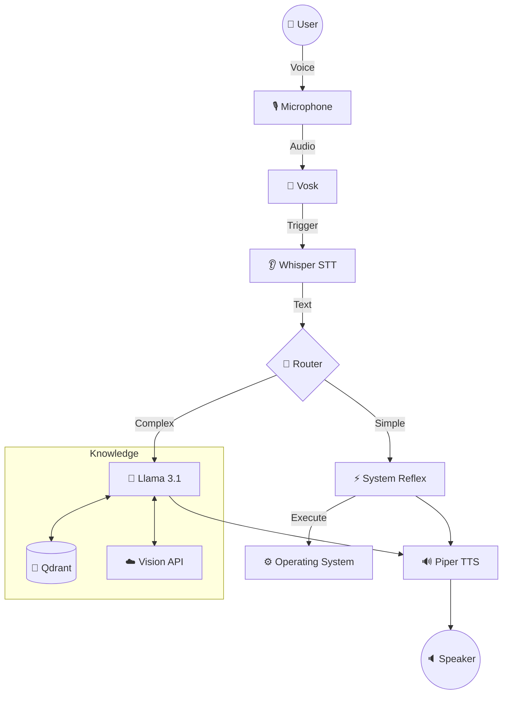

# 🏗️ System Overview

A1 is a **Hub-and-Spoke** system designed for modularity and privacy.

## 🌌 High Level Architecture

## 📦 Data Layers

| Layer | Data Type | Latency |
| :--- | :--- | :--- |
| **Sensory** | Raw Audio (`int16`), Images | < 10ms |
| **Perception** | Text, Base64 | ~1.5s |
| **Cognition** | Token Stream, JSON | ~20 tok/s |
| **Action** | API Calls, Syscalls | Instant |

---
## 🕸️ Connections
- Detailed flow: [[System/Architecture_ReAct_Loop|ReAct Loop]].
- Design choices: [[Design/Design_Decisions|Decisions Log]].
- Security: [[Design/Threat_Model|Threat Model]].

[[00_Index|🔙 Return to Index]]
