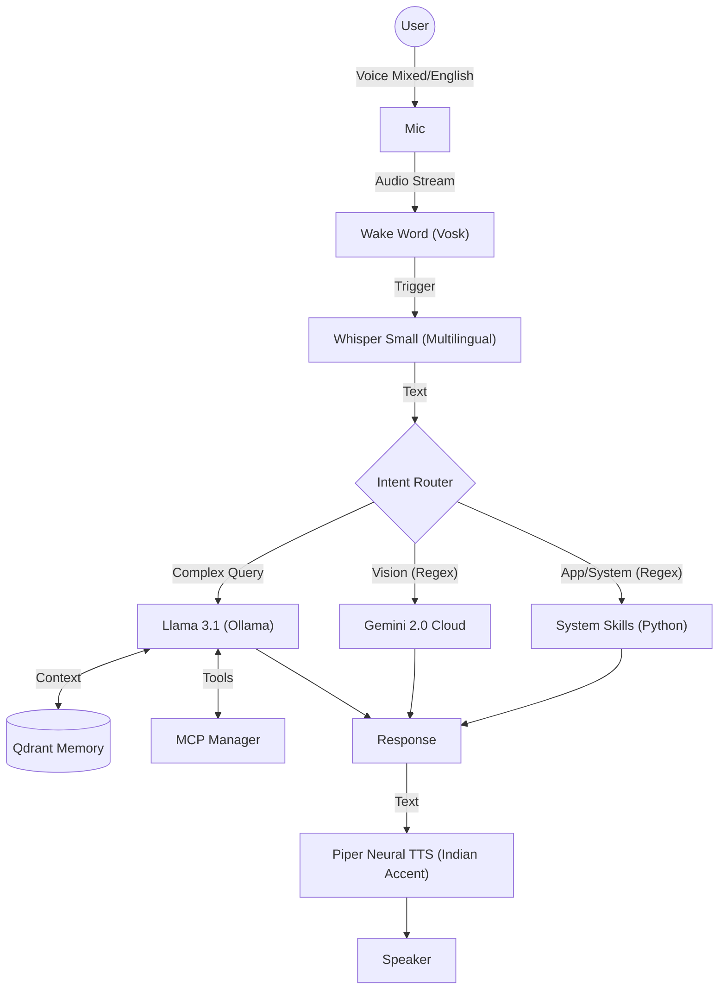

# A1 - Multilingual Local AI Assistant

<div align="center">


**A privacy-first, offline voice assistant that speaks your language.**  
*English · Tamil · Tanglish · Code-Switching*

[Features](#-features) • [Installation](#-installation) • [Usage](#-usage) • [Architecture](#%EF%B8%8F-architecture) • [Documentation](DOCUMENTATION.md)

</div>

---

## ⚡ Introduction

**A1** is a next-generation voice assistant built for Linux power users who demand privacy, speed, and flexibility. Unlike cloud-based assistants, A1 runs **entirely locally** (with optional cloud vision) and is designed to understand the way you actually speak—whether that's formal English or casual **Tanglish** (Tamil-English mix).

It integrates deeply with your OS to manage packages, control windows, and automate workflows using an agentic "Brain" powered by **Llama 3.1**.

## 🌟 Key Features

### 🗣️ True Multilingual Support
A1 doesn't just translate; it understands **Code-Switching**.
- **English**: "Open Firefox."
- **Tanglish**: "Firefox open pannu." (Subject-Object-Verb support)
- **Tamil**: "Time enna?" (Responds in English/Tanglish)

### 🧠 Advanced Intelligence
- **Brain**: Powered by **Llama 3.1 8B** (via Ollama) for reasoning and conversation.
- **Memory**: Uses **Qdrant** vector database to remember context and user details.
- **Tools**: Supports **Model Context Protocol (MCP)** to connect to GitHub, Filesystem, and more.

### 👁️ Visual Understanding
- Integrates **Gemini 2.0 Flash** (via OpenRouter) to "see" your screen.
- **Use Case**: "Look at this error log and tell me how to fix it."

### 🎙️ Human-Like Voice & Hearing
- **Ears**: Adaptive Whisper (Small) model that learns your voice signature (`SpeechBrain`).
- **Mouth**: **Piper Neural TTS** providing a high-quality Indian accent (Telugu/Tamil proxy) with low latency.

### 🎨 Siri-Style Visual Overlay (NEW!)
- **Tauri v2** native overlay that behaves like Apple Siri
- **Always visible** but **never interrupts** your work
- **Click-through** - mouse clicks pass through to apps behind
- **Non-focusable** - keyboard always goes to your active app
- **Visual States**:
  - 🟣 **Purple** (Idle) - Waiting for wake word
  - 🟢 **Green** (Listening) - Waveform animation
  - 🟠 **Orange** (Thinking) - Processing your request
  - 🔵 **Blue** (Speaking) - Responding to you

---

## 🛠️ Technology Stack

| Component | Technology | Role |
| :--- | :--- | :--- |
| **LLM Inference** | `Ollama` / `Llama 3.1 8B` | The reasoning core. |
| **STT (Hearing)** | `OpenAI Whisper` (Small) | Multilingual transcription. |
| **Wake Word** | `Vosk` | Low-power offline trigger ("Hey A1"). |
| **TTS (Speaking)** | `Piper Neural TTS` | Offline, high-quality speech synthesis. |
| **Vector DB** | `Qdrant` + `All-MiniLM` | Long-term memory storage. |
| **Vision** | `Gemini 2.0 Flash` | Screenshot analysis (Cloud). |
| **GUI Overlay** | `Tauri v2` + `Rust` | Siri-style non-intrusive visual feedback. |
| **Router** | `Regex` + `Python` | Deterministic intent routing. |

---

## 🚀 Installation

### Prerequisites
- **OS**: Arch Linux (Recommended) or Ubuntu.
- **Python**: 3.10+.
- **Hardware**: 8GB+ RAM. NVIDIA GPU recommended for faster Whisper/Llama.

### Setup Guide

```bash
# 1. Clone the repository
git clone https://github.com/mittai17/Project-A1.git
cd Project-A1

# 2. Run the Setup Script
# This installs system packages (ffmpeg, portaudio) and sets up the venv.
chmod +x setup.sh
./setup.sh

# 3. Pull AI Models (Crucial)
# Ensure Ollama is running first ('ollama serve')
ollama pull llama3.1:8b
ollama pull all-minilm

# 4. Configure Environment
# Add OPENROUTER_API_KEY if you want Vision support.
nano .env

# 5. Voice Enrollment (Optional but Recommended)
# Train A1 to recognize your specific voice.
./venv/bin/python core/voice_enroll.py
```

---

## 🎮 Usage

Start the assistant:
```bash
./venv/bin/python main.py
```

### 💬 Voice Commands

**Wake Word:** "Hey A1" (Wait for the beep/prompt)

| Category | Command Examples | Notes |
| :--- | :--- | :--- |
| **App Control** | "Open Terminal", "Close Code", "Firefox Start pannu" | Supports English & Tanglish. |
| **System** | "Update System", "Check RAM", "System shutdown sei" | Arch Linux specific (`yay`). |
| **Vision** | "Look at the screen", "Analyze this image" | Takes a screenshot & sends to Gemini. |
| **Search** | "Search for python tutorials", "News padi" | Web search summary. |
| **Coding** | "Write a python script to sort a list" | Uses Llama 3.1. |
| **Chat** | "Tell me a joke", "Sing a song" | General conversation. |

### 🛑 Interruption
A1 supports "Barge-in". Say **"Stop"**, **"Wait"**, or **"Cancel"** while it is speaking to silence it immediately.

---

## 🏗️ Architecture



---

## 🤝 Contributing

A1 is open-source! We love contributions, especially for:
1.  **New Skills**: Add python scripts in `skills/`.
2.  **Language Support**: Add more regex patterns for other Indian languages.
3.  **Optimization**: Speed up the Inference loop.

**License**: MIT
