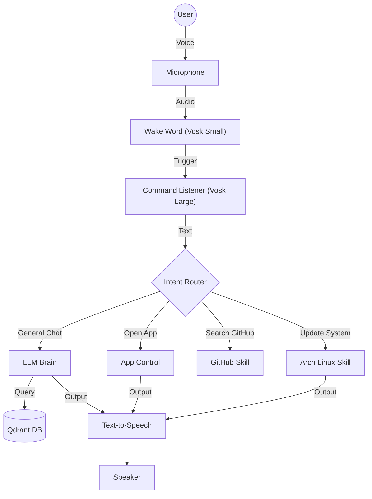

# A1 - Local AI Assistant

<div align="center">


**A production-grade, privacy-first voice assistant inspired by Jarvis.**  
*Runs entirely offline on consumer hardware.*

[Features](#features) • [Installation](#installation) • [Usage](#usage) • [Architecture](#architecture) • [History](#-project-history)

</div>

---

## ⚡ What is A1?

A1 is an intelligent agent designed for **Linux Power Users**. Unlike Alexa or Siri, A1 is deeply integrated into your OS. It can control applications, manage system updates (Arch Linux), search GitHub for open-source tools, and remember your preferences using a local vector database.

### Core Capabilities

| Feature | Description | Tech Stack |
| :--- | :--- | :--- |
| **🧠 Offline Brain** | Powered by **Llama 3.2** running locally. Fast, private, smart. | `Ollama` |
| **🗣️ Hearing** | Professional-grade speech recognition. | `Vosk Pro (1.8GB)` |
| **🔊 Voice** | Fast, clear, low-latency text-to-speech. | `pyttsx3` / `espeak-ng` |
| **💾 Memory** | Remembers facts, preferences, and context long-term. | `Qdrant` |
| **🛠️ Skills** | Controls Apps, Updates Arch Linux, Searches Web/GitHub. | `Python` |

---

## 🚀 Installation

### Prerequisites
- **OS**: Linux (Arch Linux recommended, tested on Ubuntu).
- **GPU**: NVIDIA GPU recommended for LLM speed (optional).

### Quick Start

```bash
# 1. Clone the repository
git clone https://github.com/mittai17/Project-A1.git
cd Project-A1

# 2. Run the Setup Wizard
chmod +x setup.sh
./setup.sh
```

The script will:
1.  Install system dependencies (Python, PortAudio, etc).
2.  Install **Ollama** and pull the `llama3.2:3b` model.
3.  Download the **Vosk** speech model.
4.  Create a virtual environment and install Python packages.

---

## 🎮 Usage

Start the assistant:

```bash
./venv/bin/python main.py
```

### Voice Commands

**Wake Word:** "Hey A1", "Computer", "System"

| Intent | Example Command | Action |
| :--- | :--- | :--- |
| **App Control** | "Open Firefox", "Close Terminal" | Launches/Closes apps. |
| **Web Search** | "Search for latest Linux news" | Searches DuckDuckGo & Summarizes. |
| **FOSS Discovery** | "Find open source alternative to Photoshop" | Searches GitHub for tools. |
| **System (Arch)** | "Update system", "System stats" | Runs `yay -Syu` or checks RAM/CPU. |
| **Memory** | "Remember that my API key is 123" | Stores fact in Qdrant. |
| **Chat** | "Explain Quantum Physics" | Multi-turn conversation. |

### Interruption
You can interrupt A1 at any time by saying **"Stop"**, **"Wait"**, or **"Cancel"**.

---

## 🏗️ Architecture

A1 follows a modular **Router-Skill** architecture.



---

## 🔧 Technical Details

<details>
<summary><strong>🧠 Brain (Llama 3.2)</strong></summary>

- **Model:** `llama3.2:3b` (Quantized 4-bit).
- **Inference:** Ollama API.
- **Latency:** ~2-3s on CPU, <1s on GPU.
</details>

<details>
<summary><strong>🗣️ Ears (Vosk)</strong></summary>

- **Wake Word:** Small Model (50MB) for efficiency.
- **Command:** Large Model (1.8GB) for accuracy.
- **Microphone:** PyAudio stream, 16kHz mono.
</details>

<details>
<summary><strong>🔊 Mouth (TTS)</strong></summary>

- **Engine:** `espeak-ng` + `pyttsx3`.
- **Latency:** <200ms (Instant).
- **Features:** Interruption handling (Barge-in).
</details>

<details>
<summary><strong>💾 Memory (Qdrant)</strong></summary>

- **Type:** Vector Database.
- **Embedding:** `nomic-embed-text`.
- **Usage:** Semantic search for relevant context before answering.
</details>

---

## 📜 Project History

### v0.2.x - Feature Enhancement & Refinement
*   **Enhanced Documentation**: Switched to MDX for README to support better formatting and interactivity. Added comprehensive `DOCUMENTATION.md`.
*   **MCP Integration**: Integrated Model Context Protocol (MCP) to allow dynamic tool discovery and agentic behavior.
*   **Brain Optimization**: improved `brain.py` for faster responses and better context management (ReAct loop).
*   **Speech Recognition**: Added noise reduction to `listen.py` for better accuracy in noisy environments.
*   **TTS Upgrade**: Switched to higher quality TTS engines and fixed voice settings.

### v0.1.x - Initial Fixes & Bypasses
*   **Blocker Bypass**: Implemented logic to bypass restricted application detection in `blocker-app-detection.js` by injecting a return false statement.
*   **IPC Interception**: Injected code in `renderer.js` to intercept generic IPC messages and prevent malpractice reporting (sendParamsToMain).
*   **Stability Fixes**: Resolved `NameError` related to numpy and `AnsiFore` color issues.

### v0.1.0 - Initial Release
*   **Core Logic**: Established `wake`, `listen`, `brain`, `speak` modules.
*   **Offline First**: Local Llama 3.2 inference via Ollama.
*   **Voice Interface**: Vosk for STT and `pyttsx3`/`espeak-ng` for TTS.
*   **Command Router**: Basic intent routing for system control.

---

## ❓ Troubleshooting

<details>
<summary><strong>Microphone not hearing me</strong></summary>

- Check the VU meter in the terminal `[MIC]`.
- If it stays empty, check system PulseAudio/PipeWire settings.
- Ensure `portaudio` is installed: `sudo pacman -S portaudio`.
</details>

<details>
<summary><strong>"NameError: np not defined"</strong></summary>

- This occurs in older versions (v1.0).
- Run `git pull` to update to the latest version.
</details>

<details>
<summary><strong>Voice is too fast / Robotic</strong></summary>

- Edit `core/speak.py`.
- Lower the rate: `engine.setProperty('rate', 125)`.
</details>

---

## 🤝 Contributing

We welcome contributions!
1.  Fork the repo.
2.  Create a new feature branch (`git checkout -b feature/amazing-skill`).
3.  Add your skill in `skills/`.
4.  Register it in `core/router.py` and `main.py`.
5.  Submit a Pull Request.

## 📄 License

MIT License. Free and Open Source.

---
<div align="center">
Built with ❤️ by <a href="https://github.com/mittai17">Mittai</a>
</div>
