# 🛸 A1 Assistant Knowledge Base

> **Local Intelligence. Multilingual Voice. Agentic Control.**

Welcome to the central documentation hub for **Project A1**. This vault contains technical specifications, architecture diagrams, and user guides for the A1 Voice Assistant.

## 🗺️ Navigation Map

### 🔹 [[System/System_Overview.md|System Overview]]
High-level architecture, data flow, and design philosophy.
- [[System/Architecture_ReAct_Loop.md|The ReAct Loop]]
- [[System/Directory_Structure.md|Directory Structure]]

### 🔹 [[Core/Core_Brain_LLM.md|Core: The Brain (Llama 3.1)]]
The cognitive reasoning engine.
- [[Core/Core_Adaptive_ASR.md|Hearing & STT]]
- [[Core/Core_Router.md|Reflex Router]]
- [[Core/Core_TTS.md|Speech Synthesis]]
- [[Core/Core_Memory.md|Memory (Qdrant)]]

### 🔹 [[Operations/Runbook.md|Operations & User Manual]]
Daily usage, voice commands, and maintenance.
- [[Operations/Installation.md|Installation Guide]]
- [[Operations/Troubleshooting.md|Troubleshooting]]
- [[Guides/Obsidian_Setup.md|Obsidian Plugin Guide]]

### 🔹 Daily Logs
Track progress and updates.
- [[Daily_Logs/2026-01-18|2026-01-18 (Multilingual Update)]]

---

## 🧩 System Architecture

```mermaid
graph LR
    User([👤 User]) <-->|Voice/Display| A1[🤖 A1 Assistant]
    
    subgraph "Core Capabilities"
        A1 --> Hearing(👂 Adaptive Hearing)
        A1 --> Speaking(🗣️ Neural Speech)
        A1 --> Brain(🧠 Llama 3.1 Brain)
        A1 --> Vision(👁️ Screen Vision)
    end
    
    subgraph "World Interaction"
        Brain <--> Memory[(💾 Qdrant DB)]
        Brain --> Tools[🛠️ MCP Tools]
        Hearing --> Router{🔀 Router}
        Router --> System[⚙️ Arch Linux]
    end
    
    classDef core fill:#232,stroke:#fff,stroke-width:2px;
    class A1,Brain core;
```

---

## 🛠️ Quick Status

| Component | Status | Tech Stack |
| :--- | :--- | :--- |
| **LLM** | 🟢 Local | `llama3.1:8b` (Ollama) |
| **STT** | 🟢 Local | `whisper-small` + `vosk` |
| **TTS** | 🟢 Local | `piper` (Indian Accent) |
| **Vision** | 🟠 Cloud | `gemini-2.0-flash` |
| **Memory** | 🟢 Local | `qdrant` + `all-minilm` |

> **Legend**: 🟢 Offline/Local | 🟠 Cloud API

---
## 🕸️ Knowledge Graph
- [[Roadmap/Roadmap|Future Roadmap]]
- [[Design/Design_Decisions|Why we built it this way]]
- [[Design/Threat_Model|Security & Risks]]
- [[Operations/Runbook|Daily Operations]]
