# 🧠 Core: Brain (Llama 3.1)

The Brain is the **Agentic Core** of A1, powered by **Llama 3.1 8B**. using a **ReAct (Reason + Act)** loop to solve problems.

## 🧬 Cognitive Lifecycle

```mermaid
sequenceDiagram
    autonumber
    
    actor User as 👤 User
    participant Brain as 🧠 Llama 3.1
    participant Mem as 💾 Qdrant
    participant Tool as 🛠️ MCP Tool
    participant TTS as 🔊 Piper

    User->>Brain: "Find a PDF parsing library"
    
    Note over Brain: 🌀 Thinking...
    
    Brain->>Mem: Recall Context
    
    Brain->>Brain: "I need to search external sources."
    
    rect rgb(30, 30, 40)
        Note right of Brain: 🛠️ Tool Execution
        Brain->>Tool: [[CALL:github_search("python pdf parser")]]
        Tool-->>Brain: {results: ["PyPDF2", "pdfminer"]}
    end
    
    Brain-->>TTS: "I found PyPDF2 and PDFMiner..."
    TTS-->>User: (Speaks Response)
```

## ⚙️ Configuration

- **Model**: `llama3.1:8b` (Quantized 4-bit)
- **Context Window**: 8k Tokens
- **System Prompt**: See `SYSTEM_PROMPT.md`
- **Temperature**: `0.0` (Strict/Deterministic)

## 🛠️ Tool Capabilities (MCP)
The Brain connects to the **Model Context Protocol** to use tools:
1.  **Filesystem**: Read/Write local files.
2.  **GitHub**: Search repos and code artifacts.
3.  **Memory**: Explicitly save facts.

---
## 🕸️ Connections
- Uses [[Core/Core_Memory|Memory System]] for context.
- Sends output to [[Core/Core_TTS|Speech Module]].
- Receives queries from [[Core/Core_Router|Router]].
- Executed via [[System/Architecture_ReAct_Loop|ReAct Loop]].
- See [[Design/Design_Decisions#1. Why Llama 3.1 8B?|Design Rationale]].

[[00_Index|🔙 Return to Index]]
