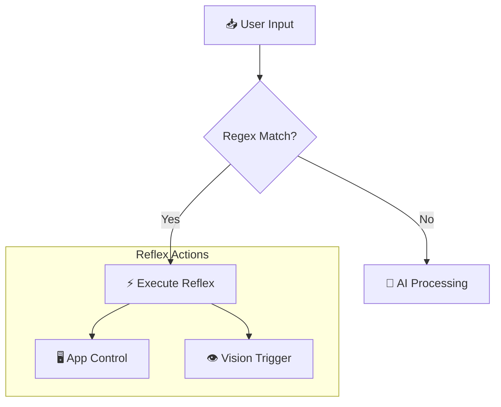

# 🔀 Core: Reflex Router

The Router provides **Zero-Latency** responses for common commands, bypassing the slow LLM Brain.

## 🚦 Decision Tree

## 🧩 Regex "Cheat Sheet"

The router handles grammatical variations (SVO vs SOV).

### 1. App Control
| Type | Regex Pattern | Matches |
| :--- | :--- | :--- |
| **Prefix (English)** | `^(open\|close) (.+)` | "Open Firefox" |
| **Suffix (Tanglish)** | `^(.+) (open\|close)( pannu)?$` | "Firefox open pannu" |

### 2. Vision Triggers
- `look at.*`
- `analyze.*`
- `read.*screen`

---
## 🕸️ Connections
- Receives input from [[Core/Core_Adaptive_ASR|Hearing Module]].
- Routes complex tasks to [[Core/Core_Brain_LLM|Brain]].
- Triggers skills like [[Skills/Skill_App_Control|App Control]] and [[Skills/Skill_Arch_Linux|System Update]].
- See [[Design/Design_Decisions#3. Why Rule-Based Router?|Design Rationale]].

[[00_Index|🔙 Return to Index]]
